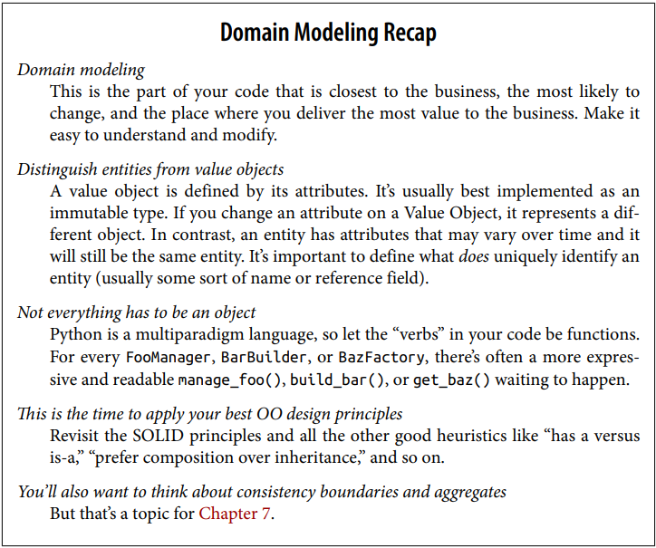
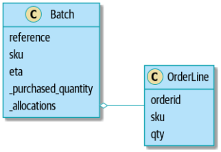

# architecture-patterns-with-python

**Studies from the book:**

Architecture Patterns with Python: Enabling Test-Driven Development, Domain-Driven Design, and Event-Driven Microservices
from Harry J.W. Percival & Bob Gregory

This project was build by coding along with the book using best practices when domain modelling and working with data from
the database.

**Implemented Concepts**
- Domain modelling
- Dependency Inversion
- Repository Pattern
- Unit testing (_lots_)

**Libraries**
- pytest
- flask
- sqlalchemy

---
## Part 1. Building an Architecture to Support Domain Modeling
---
### Chapter 1: Domain Modeling
General Tips:
- Make sure to express rules from the domain model in the business jargon (ubiquitous language)
- Unit testing domain models
- Use Value Object pattern for represent a concept that has data but no identity (any object that is identified only by its data and doesn’t have a long-lived identity)
- Use the term entity to describe a domain object that has long-lived identity (persistent identity, like a name or a reference)
- **Not everything has to be an Object: domain service function**
- Exceptions Can Express Domain Concepts Too

Python Tips:
- Type Hints
- Dataclasses are greate for value objects
- Equality operators (__hash__, __eq__, __lt__, __gt__) for entities

#### Domain Modeling Recap

#### Domain (UML and Model):

---
