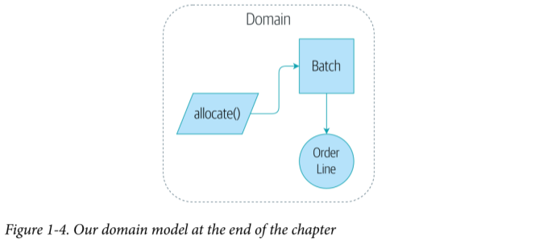

# architecture-patterns-with-python

**Studies from the book:**

Architecture Patterns with Python: Enabling Test-Driven Development, Domain-Driven Design, and Event-Driven Microservices
from Harry J.W. Percival & Bob Gregory

This project was build by coding along with the book using best practices when domain modelling and working with data from
the database.

**Implemented Concepts**
- Domain modelling
- Dependency Inversion
- Repository Pattern
- Unit testing (_lots_)

**Libraries**
- pytest
- flask
- sqlalchemy

---
State of the domain after end of Chapter 1:

