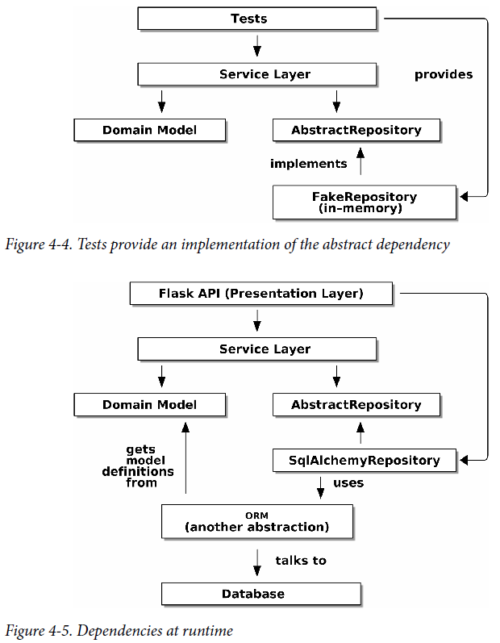

# architecture-patterns-with-python

**Studies from the book:**

Architecture Patterns with Python: Enabling Test-Driven Development, Domain-Driven Design, and Event-Driven Microservices
from Harry J.W. Percival & Bob Gregory

This project was build by coding along with the book using best practices when domain modeling and working with data from the database.

**Implemented Concepts**
- Domain modelling
- Dependency Inversion
- Repository Pattern
- Service Layer
- TDD
- Unit, integration and e2e testing (_lots_)

**Libraries**
- pytest
- flask
- sqlalchemy

---
## Part 1. Building an Architecture to Support Domain Modeling

Summay:

---
### Chapter 1: Domain Modeling
General Tips:
- Make sure to express rules from the domain model in the business jargon (ubiquitous language)
- Unit testing domain models
- Use Value Object pattern for represent a concept that has data but no identity (any object that is identified only by its data and doesn’t have a long-lived identity)
- Use the term entity to describe a domain object that has long-lived identity (persistent identity, like a name or a reference)
- **Not everything has to be an Object: domain service function**
- Exceptions Can Express Domain Concepts Too

Python Tips:
- Type Hints
- Dataclasses for value objects
- attrs
- Equality operators (__hash__, __eq__, __lt__, __gt__) for entities

#### Chapter 1 Recap

#### Domain (UML and Model):

---
### Chapter 2: Repository Pattern
General Tips:
- ORM depends on Model (not the other way around), the domain model stays “pure” and free from infrastructure concerns
- The Repository pattern is an abstraction over persistent storage
- Whenever we introduce an architectural pattern, we’ll always ask, “What do we get for this? And what does it cost us?”
- Using a fake repo in tests is really easy
- Building fakes for your abstractions is an excellent way to get design feedback: if it’s hard to fake, the abstraction is probably too complicated
- If your app is just a simple CRUD wrapper around a database, then you don’t need a domain model or a repository

Python Tips:
- SQLAlchemy mapper (ORM)
- pytest fixtures
- SQLite in-memory db
- Delete ABCs from our production code, because Python makes it too easy to ignore them, and they end up unmaintained. In practice we often just rely on Python’s duck typing to enable abstractions

#### Chapter 2 Recap

#### Domain model w/ Repository pattern trade-offs

#### Repository pattern

---
### Chapter 3: On Coupling and Abstractions

---
### Chapter 4: Flask API and Service Layer
General Tips:
- Adding a service layer (also called orchestration layer) can be useful for testing. This way, you can better assign the responsibilities of the service layer and the API, which become responsible for dealing with HTTP and web stuff.
- Define a clear API for your domain. Those can be used by any adapter (entrypoint), an API or a CLI.
- Design so that your services **depends on abstractions**. This is useful, specially with the repository pattern, so
you can easily change the component you are using in testing and production (we used FakeRepository and SQLAlchemyRepository).
- The service layer drives the application: 1. Get some data from the database. 2. Update the domain model. 3. Persis any changes.
- Look for **domain services** in your application - A piece of logic that belongs to the domain model, but doesn't sit naturally
inside a stateful entity (e.g. allocate function).

#### Service Layer trade-offs

#### Service Layer

